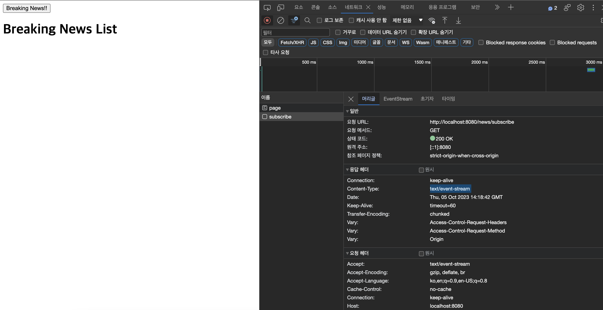
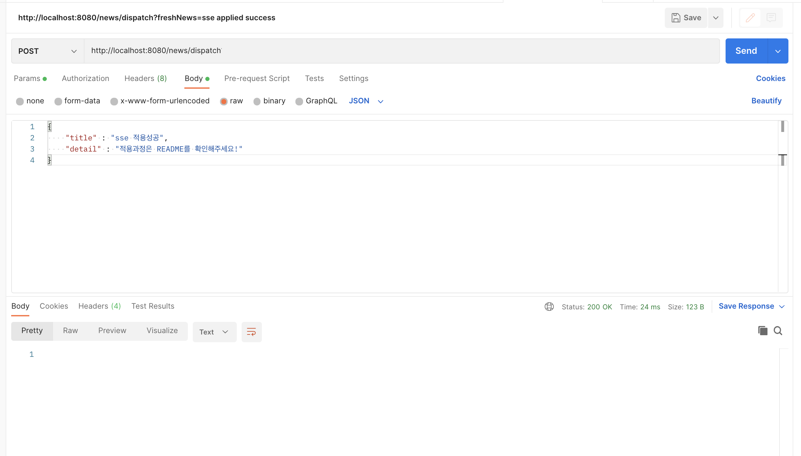
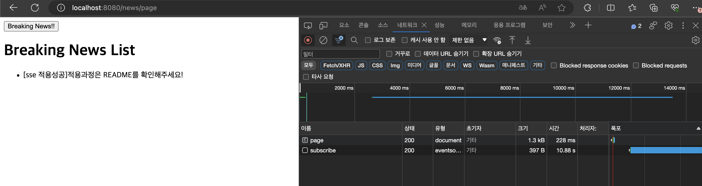

# Server-Sent-Events(SSE)

이 레포지토리는 SSE를 `Javascript[Client]`, `Java Spring[Server Side]`를 활용하여 구현하였습니다.

## Server-Sent-Events란?

서버에서 클라이언트로 단방향으로 데이터를 전달할 수 있는 단방향 통신 채널입니다. 
Polling과 같이 클라이언트가 주기적으로 http요청을 보낼 필요 없이 처음 http 연결을 맺고 나면 서버에서 클라이언트로 실시간, 지속적으로 데이터를 보낼 수 있어 리소스 낭비가 적습니다.

단, 클라이언트의 요청없이 서버에서 클라이언트에게 단방향 통신을 하기 때문에 모든 실시간 통신이 필요한 기능에는 사용하지 못한다는 단점이 있습니다.
그래서 클라이언트가 서버로 실시간으로 요청을 보내야하는 채팅 프로그램에서는 사용하기 적절하지 않고, **주식시세/실시간 검색 목록/스트리밍 서비스** 등 실시간 정보를 전달할 때 사용하기 적절합니다.

## 특징
- JavaScript는 SSE를 쉽게 사용할 수 있도록 EventSource API를 제공하고 있습니다.
- 별도의 프로토콜을 사용하지 않고 HTTP 프로토콜만으로 사용이 가능하기 때문에 훨씬 가볍습니다.
- 최대 동시 접속 수는 HTTP/1.1는 브라우저 당 6개, HTTP/2는 100개까지 가능합니다.
- IE를 제외한 브라우저에서 지원됩니다.
- 이벤트 데이터는 UTF-8 인코딩된 문자열만 지원됩니다.
- 클라이언트에서 페이지를 닫아도 서버에서 감지하기가 어렵다는 단점이 있습니다.

## SSE 구현

### [Client] Javascript EventSource API를 통한 SSE 구현

```javascript
const url = '' // 구독할 URL
const eventSource = new EventSource(url);

// 앞에서 설정해둔 sseEvent name을 구독한다.(breakingNews)
eventSource.addEventListener("breakingNews", (e) => {
    console.log(e.data)
    var articleData = JSON.parse(e.data);
    var articleBlock = document.createElement('li')
    var articleDetail = document.createTextNode(articleData.detail);
    articleBlock.append('[' +articleData.title+ ']');
    articleBlock.append(articleDetail);

    document.getElementById('breaking-news-list').appendChild(articleBlock);
});

```

### [Server] Spring SseEmitter을 통한 SSE 구현
spring에서 sse을 어떻게 적용하는지 알아보겠습니다. 
spring framework 4.2부터 SSE 통신을 지원하는 SseEmitter 클래스가 생겼습니다. 
이 repository에서는 sseEmitter을 사용해서 구현하려고 합니다.

#### Client에서 구독하기 위해 호출하는 URL

저는 뉴스 속보를 실시간으로 고객이 구독하고 싶다는 상황을 가정하고 URL을 구현했습니다.
아래 URL을 호출하게 되면 SSE가 적용되었기 때문에 호출 시점부터 뉴스를 구독할 수 있게 됩니다.


```java
public List<SseEmitter> emitters = new CopyOnWriteArrayList<>(); // Thread Safe

@CrossOrigin
@GetMapping(value = "/subscribe", consumes = MediaType.ALL_VALUE, produces = MediaType.TEXT_EVENT_STREAM_VALUE)
public SseEmitter subscribe() {
    1) sseEmitter 생성 및 TIME_OUT 설정
    SseEmitter sseEmitter = new SseEmitter(TIME_OUT);
    try {
        // 2) 기본 데이터를 날리지 않으면 503에러 발생
        sseEmitter.send(
                SseEmitter.event()
                .name("init")
        );
    } catch (IOException e) {
        e.printStackTrace();
    }
    emitters.add(sseEmitter);

    // 3) sseEmitter가 완료되면 에러 발생
    sseEmitter.onCompletion(() -> {
        emitters.remove(sseEmitter);
    });

    // 4) sseEmitter가 timeout 되면 실행
    sseEmitter.onTimeout(() -> {
        emitters.remove(sseEmitter);
    });
    return sseEmitter;
}
```

#### '/news/subscribe' 호출 시 sseEmitter구독 시연

Breaking New! 버튼을 클릭하면 앞서 개발해두었던  '/news/subscribe' URL을 호출 하게 되고
구독을 시작하게 됩니다. 



화면을 확인해보면 `Content-Type`이 `text/event-stream`으로 잘 설정된 것을 확인할 수 있습니다.

### 구독하고 있는 고객에게 데이터 dispatch

마찬가지도 데이터를 dispatch하는 부분도 뉴스 속보를 실시간으로 dispatch한다는 상황을 가정하고 구현했습니다.
requestBody로 title(제목), detail(본문) 구조를 가진 데이터를 전달받므녀
구독하고 있는 sseEmitter에게 데이터를 실시간으로 dispatch합니다.

requestBody json구조

```json
{
  "title": "제목",
  "detail": "내"
}
```

Spring 구현

```java

public List<SseEmitter> emitters = new CopyOnWriteArrayList<>(); // Thread Safe

// method for client sucscription
...

// method for dispatching event to all clients


@PostMapping("/dispatch")
public void dispatchNews(@RequestBody Map<String, String> article) {
    // 1) NullPointException 방지
    emitters = (emitters==null) ? new CopyOnWriteArrayList<>(): emitters;
    System.out.println(emitters.toString());
    
    // 2) 구독하고 있는 sseEmitters에게 데이터 실시간 전달
    emitters.forEach(emitter -> {
        try {
            // name
            emitter.send(
                    SseEmitter.event()
                            .name("breakingNews")
                            .data(article)
            );
        } catch (IOException e) {
            e.printStackTrace();
            // 3) 에러 발생하는 emitter는 목록에서 제거
            emitters.remove(emitter);
        }
    });
}

```
#### 실시간 정보를 고객에게 전달 기능 시연

실시간 정보를 업데이트 및 고객에게 전달하는 API를 호출합니다.
앞서 개발해두었던 `/news/dispatch`입니다.

RequestBody에 아래 json을 함께 담아 호출합니다.

```json
{
  "title": "sse 적용성공",
  "detail": "적용과정은 README를 확인해주세요."
}

```



호출하게 되면 구독하고 있는 클라이언트 화면에 실시간으로 뉴스속보 데이터가 노출되게 됩니다.



